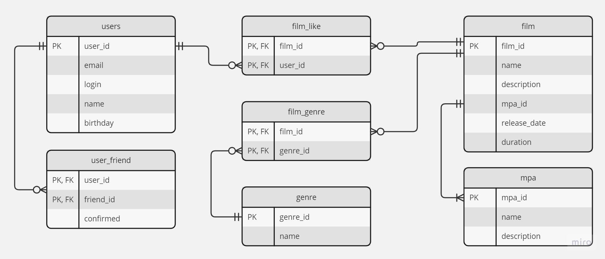

# java-filmorate

## Диаграмма отношений объектов (Entity Relationship Diagram - ERD)



### Получение пользователя по id
``` roomsql
SELECT user_id,
       email,
       login,
       name,
       birthday
FROM users
WHERE user_id = ?;
```

### Получение всех пользователей
``` roomsql
SELECT user_id,
       email,
       login,
       name,
       birthday
FROM users;
```

### Получение друзей пользователя
В таблице user_friend хранится связь пользователь -> друг. Колонка confirmed хранит булевое значение:
1 - связь подтверждена,
0 - связь не подтверждена.
Считаем, что подтвержденная связь является однонаправленной.
Для получения списка всех друзей пользователя выполняем запрос:
``` roomsql
SELECT friend_id AS user_id
FROM user_friend
WHERE confirmed = TRUE
AND user_id = ?
```

### Получение идентификаторов популярных фильмов:
``` roomsql
SELECT f.film_id
FROM film f
LEFT JOIN film_like l
ON f.film_id = l.film_id;
GROUP BY f.film_id
ORDER BY COUNT(l.*);
```